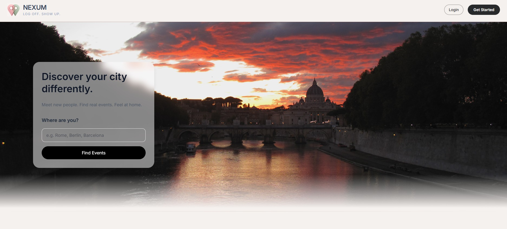
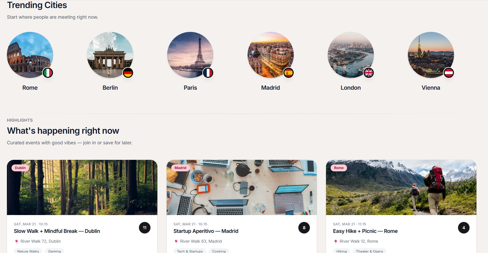
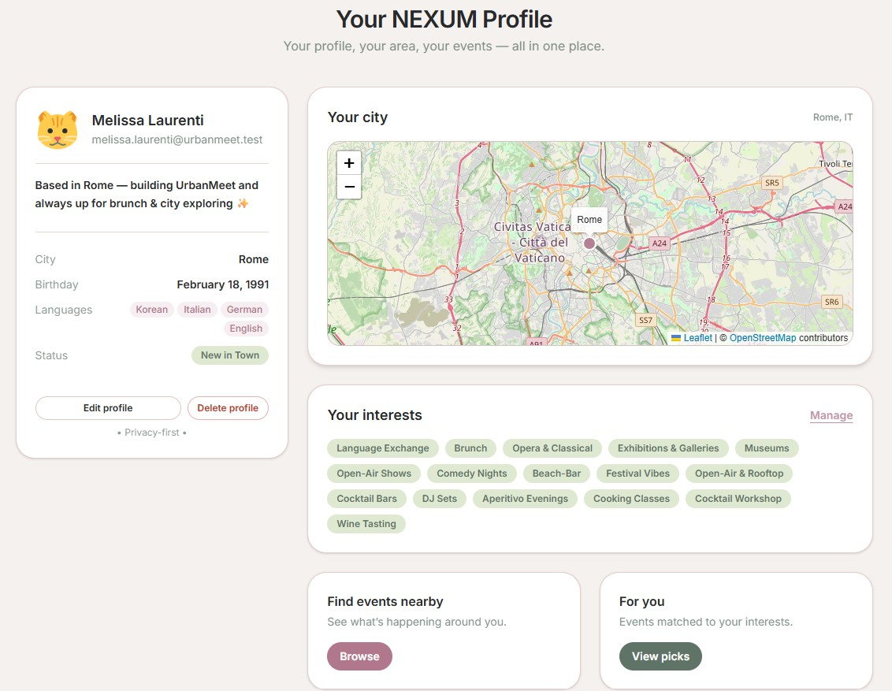

NEXUM  
Log off. Show up.

  

Privacy-first platform to discover real-world events in your city — supported by AI, designed for safe group experiences.

---

WHAT IS NEXUM?

Nexum is a community-driven event discovery platform that helps people:
- find local events  
- explore interest-based meetups  
- feel at home in a new city  

Unlike traditional social platforms, Nexum is privacy-first by design and focuses on real-world group interaction instead of private online communication.
- No direct 1:1 chats  
- No dating mechanics  
- No external WhatsApp group linking  

Users connect through shared experiences — not private messaging.
- Event-based interaction only  
- Safe, moderated group environments  

---

Platform Preview

  
  

  

---

AI-ASSISTANT

Nexum integrates AI to improve:
- event discovery  
- user onboarding  
- in-app support  
- community feedback analysis  

Examples:
Users can ask:  
**"How was the last event?"**

And receive an AI-generated summary such as:  
> "According to participants, the event was very fun and well-organised."

The AI does not invent responses. It analyses:
- user ratings  
- written feedback  
- attendance data  

…and generates aggregated summaries based on real participant experiences.

This allows:
- better event transparency  
- informed participation decisions  
- trust-based recommendations  

---

SAFETY & PRIVACY MODEL

Nexum was built with real-world safety in mind.

Interaction rules:
- Communication happens only within the context of an event  
- No persistent private chats between users  
- No off-platform messaging integrations  
- Temporary event-based group discussions only  

This reduces:
- harassment risks  
- unsolicited private contact  
- pressure to move conversations off-platform  

---

CORE FEATURES
- Multi-step onboarding flow  
- Interest-based user matching  
- Location-based discovery (Map Integration)  
- Profile overview with city map  
- Curated event suggestions  
- AI-generated event summaries  
- Avatar / profile image upload  
- Privacy-first interaction model  
